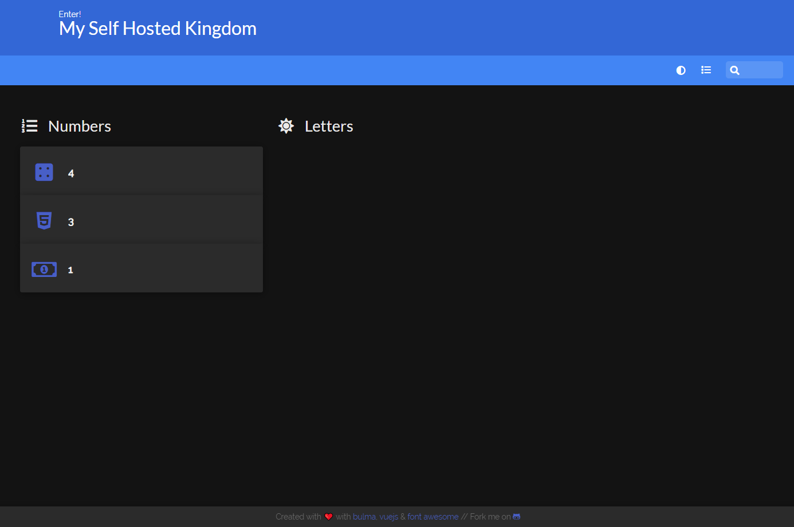
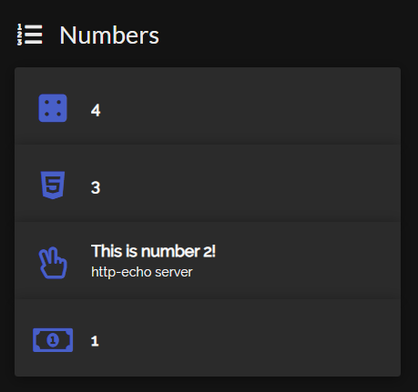

# Homer Service Discovery

This tool generates configuration files for [Homer](https://github.com/bastienwirtz/homer) using Docker container labels.

Using Docker container labels for service discovery is inspired by the same approach used by [Traefik](https://doc.traefik.io/traefik/providers/docker/) and [Watchtower](https://github.com/containrrr/watchtower).
## Features

- Generates Homer config using container labels
- Watches for container changes
- Sort items by priority
- Multi-arch

## Usage

Create a base configuration for this tool to build upon. This will contain your `services` sections, `title`, `logo`, etc. A value unique to this tool is `priority`. The higher the `priority` of an item, the higher on the list it will appear.

```yaml
title: My Self Hosted Kingdom
subtitle: Enter!

services:
  - name: Numbers
    icon: fas fa-list-ol
    items:
      - name: 4
        icon: fas fa-dice-four
        url: https://fontawesome.com/v5.15/icons/dice-four?style=solid
        priority: 4
      - name: 3
        icon: fab fa-html5
        url: https://fontawesome.com/v5.15/icons/html5?style=brands
        priority: 3
      - name: 1
        icon: far fa-money-bill-alt
        url: https://fontawesome.com/v5.15/icons/money-bill-alt?style=regular
        priority: 1

  # Empty section
  - name: Letters
    icon: fas fa-sun
    items: []
```

Start Homer following [its instructions](https://github.com/bastienwirtz/homer/blob/main/README.md) to mount the `/www/assets` directory. This is where the `config.yaml` file resides.

```sh
docker run -d \
  -p 8080:8080 \
  -v /folder1/homer/:/www/assets \
  b4bz/homer:latest
```

Start this tool while:
- mounting the base config
- mounting homer's config
- mounting the Docker socket
- using environment variables to provide their mountpoints.

```sh
docker run -d \
  -v /folder1/homer/:/config.yml \
  -v /yetAnotherFolder/base.yml:/base.yml \
  -v /var/run/docker.sock:/var/run/docker.sock:ro \
  -e HOMER_CONFIG=/config.yml \
  -e HOMER_BASE_CONFIG=/base.yml \
  ghcr.io/calvinbui/homer-service-discovery
```

You can visit your Homer Dashboard to see the initial generated config (remember to hard refresh).



Start adding labels to your containers to have this tool pick them up. For example, the following command will regenerate the config and add the `http-echo` service to the `Numbers` service.

```
docker run -d \
  -p 5678:5678 \
  -l homer.enable=true \
  -l homer.service=Numbers \
  -l homer.name='This is number 2!' \
  -l homer.subtitle='http-echo server'
  -l homer.icon='far fa-hand-peace' \
  -l homer.priority=2 \
  -l homer.url='http://localhost:5678' \
  hashicorp/http-echo \
  --text="Be yourself; everyone else is already taken"
```



The full list of labels are:

| Label | Description |
| :- | :- |
| `homer.enable` | Set to `true` include in Homer's config |
| `homer.service` | The name of Homer Service to add this item to. It must exist in the base config |
| `homer.priority` | The priority level of the service. The higher the number, the higher it appears in the Service |
| `homer.name` | The item's name (See Homer's documentation) |
| `homer.logo` | The item's logo (See Homer's documentation)|
| `homer.icon` | The item's icon (See Homer's documentation) |
| `homer.subtitle` | The item's subtitle (See Homer's documentation) |
| `homer.tag` | The item's tag (See Homer's documentation) |
| `homer.url` | The item's url (See Homer's documentation) |
| `homer.target` | The item's target (See Homer's documentation) |
| `homer.tagstyle` | The item's tagstyle (See Homer's documentation) |
| `homer.type` | The item's type (See Homer's documentation) |
| `homer.class` | The item's class (See Homer's documentation) |
| `homer.background` | The item's background (See Homer's documentation) |

## Environment Variables

| Key | Description | Default |
| :- | :- | :- |
| `LOG_LEVEL` | The level of log verbosity | `Info` |
| `HOMER_BASE_CONFIG` | Where the base config is located | `/base.yml` |
| `HOMER_CONFIG` | Where the Homer config is located | `/config.yml` |
